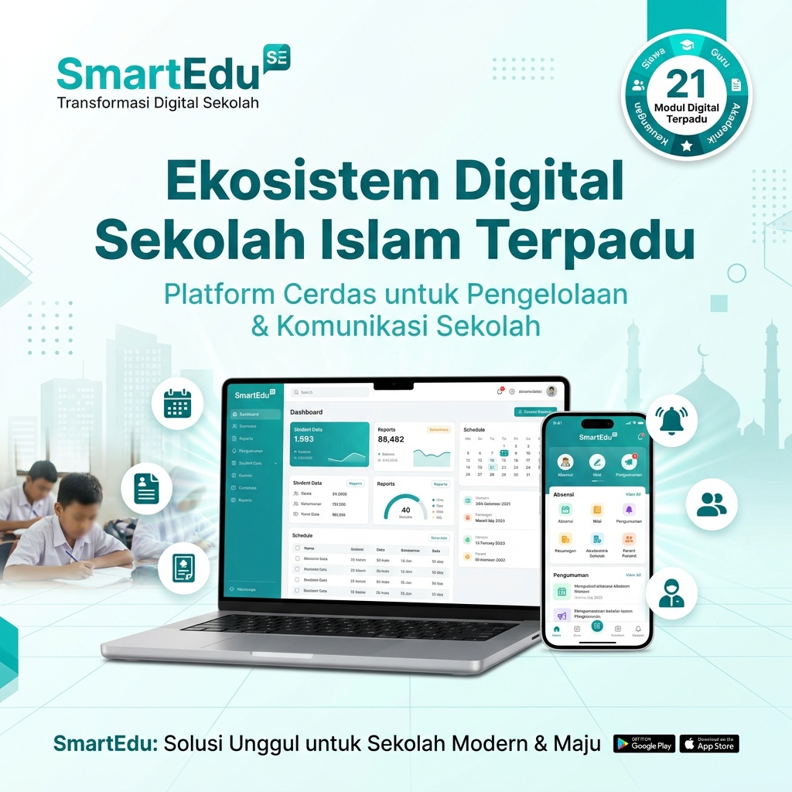

# 🏫 SmartEdu - Platform Digital & Sistem Informasi Manajemen Sekolah Islam Terpadu



[](https://laravel.com)
[](https://php.net)
[](https://tailwindcss.com)
[](#lisensi)

**SmartEdu** adalah platform ekosistem digital terpadu dan sistem informasi manajemen sekolah yang didesain khusus untuk **Sekolah Islam Terpadu (SIT)**. Menawarkan **21 Modul Digital Terpadu** yang mengintegrasikan tata kelola akademik, keuangan, kurikulum adaptif, pembentukan karakter Islami (BPI), sistem keamanan siswa *SafeSchool Anti-Bullying*, hingga asisten AI 24/7.

---

## 🌟 Fitur Utama & 21 Modul Digital Terpadu

SmartEdu mencakup 21 modul operasional yang saling terhubung secara *real-time*:

### 📚 1. Akademik & Kurikulum Adaptif
* **E-Rapor Adaptif**: Mendukung Kurikulum 13 (K13), Kurikulum Merdeka (P5), dan Kurikulum Khas JSIT.
* **CBT Online Exam**: Sistem ujian online bebas curang dengan analisis butir soal otomatis.
* **Jadwal Pelajaran & Kalender Akademik**: Pemetaan otomatis ruang kelas dan jam mengajar guru.
* **Perpustakaan Digital (E-Library)**: Peminjaman buku via QR-Code & koleksi e-book Islami.

### 💰 2. Keuangan, POS & Cashless School
* **Keuangan SPP & Payment Gateway**: Penagihan otomatis, kirim pengingat via WhatsApp, & kwitansi PDF.
* **Akuntansi COA & Jurnal Keuangan**: Pembukuan keuangan sekolah sesuai standar Akuntansi COA.
* **POS Kantin Cashless & Tabungan Siswa**: Transaksi kantin tanpa uang tunai menggunakan kartu RFID / QR Code dengan batas belanja harian yang diatur orang tua.

### 🌙 3. Character Building & Keamanan Siswa (SafeSchool)
* **Bina Pribadi Islami (BPI) & Mutabaah Yaumiyah**: Tracking ibadah harian (Sholat 5 waktu, Dhuha, Tahajud, Tilawah, Hafalan Ziyadah Al-Qur'an, & Infaq) dengan validasi PIN Orang Tua.
* **SafeSchool Anti-Bullying System 🚨**: Fitur pelaporan insiden bullying berbasis siswa dengan **Panic Alarm darurat** dan lokasi real-time yang terhubung langsung ke HP Satgas Keamanan Sekolah.

### 🤖 4. Kecerdasan Buatan & Digitalisasi Modern
* **SmartBot AI Assistant 24/7**: Chatbot AI interaktif untuk layanan informasi dan administrasi sekolah.
* **Presensi RFID & WhatsApp Gateway**: Notifikasi kehadiran siswa langsung ke WhatsApp Orang Tua.
* **Tracer Study Alumni & Verifikasi QR Code**: Legalitas e-ijazah dan direktori alumni PTN/Dunia Kerja.
* **PPDB Online (Penerimaan Siswa Baru)**: Portal seleksi dan pendaftaran calon siswa terpadu.

### ⚙️ 5. Portal CMS Admin & Branding Sekolah
* **Full CMS Admin Dashboard**: Kelola landing page, ubah nama sekolah, ganti logo, sunting modul, dan atur seksi penawaran sales/lisensi.

---

## 🛠️ Spesifikasi Teknologi (Tech Stack)

* **Framework Core**: Laravel 13.x
* **Bahasa Pemrograman**: PHP 8.4+ / PHP 8.3
* **Frontend**: Vanilla HTML5, TailwindCSS, Alpine.js
* **Asset Bundler**: Vite
* **Database**: MySQL 5.7+ / MySQL 8.0+ / MariaDB / SQLite
* **Security & Optimization**: Open Graph & WhatsApp Social Share Optimization, Responsive Light Mode UI/UX.

---

## 🚀 Panduan Instalasi Lokal (Development)

1. **Clone Repository**:
   ```bash
   git clone https://github.com/username/smartedu.git
   cd smartedu
   ```

2. **Install Depedensi Composer & NPM**:
   ```bash
   composer install
   npm install
   ```

3. **Pengaturan File `.env`**:
   ```bash
   cp .env.example .env
   php artisan key:generate
   ```

4. **Migrasi & Seed Database**:
   ```bash
   php artisan migrate --seed
   ```

5. **Build Aset & Jalankan Server**:
   ```bash
   npm run build
   php artisan serve
   ```

---

## ☁️ Panduan Deploy di Hosting cPanel (Production)

1. Upload file proyek ke cPanel.
2. Buat Database MySQL & import file database [`smartedu_database.sql`](smartedu_database.sql).
3. Sesuaikan konfigurasi file `.env`:
   ```env
   APP_NAME=SmartEdu
   APP_ENV=production
   APP_KEY=base64:...
   APP_DEBUG=false
   APP_URL=https://domainanda.com

   DB_CONNECTION=mysql
   DB_HOST=127.0.0.1
   DB_PORT=3306
   DB_DATABASE=nama_database
   DB_USERNAME=username_database
   DB_PASSWORD=password_database
   ```
4. Jalankan perintah berikut di Terminal SSH cPanel:
   ```bash
   composer install --no-dev --optimize-autoloader
   php artisan config:cache
   php artisan route:cache
   php artisan view:cache
   ```

---

## 🔑 Kredensial Default Portal Admin CMS

* **URL Login**: `https://domainanda.com/admin/login`
* **Username / Email**: `admin` *(atau `admin@smartedu.test`)*
* **Password**: `p4l3mb4ng`

---

## 📄 Lisensi & Pengembang

Didukung dan Dikembangkan oleh **[Beranda Teknologi Digital](https://berandadigital.net)**.
© 2026 SmartEdu. Hak Cipta Dilindungi Undang-Undang.
