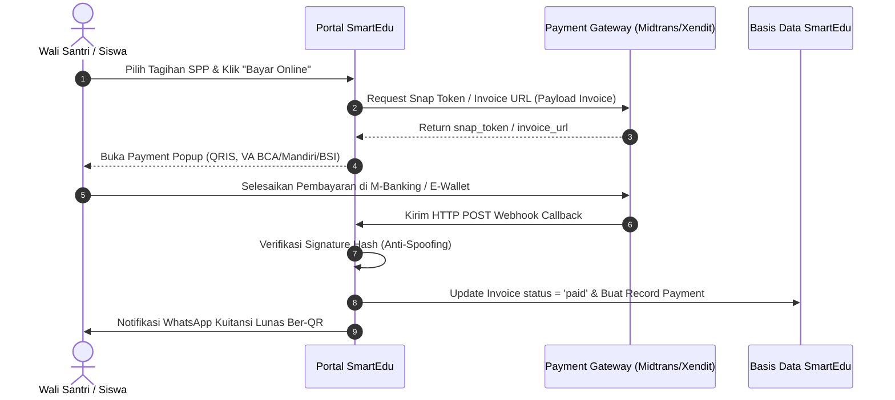

# SmartEdu SIT Robbani — API & Integration Contract (API_CONTRACT.md)

> **Spesifikasi Teknis Endpoint Internal, Webhook Callback, dan Integrasi Pihak Ketiga**

---

## 💳 1. Integrasi Payment Gateway (E-SPP & Tagihan Santri)

Sistem mendukung dua gateway pembayaran utama: **Midtrans** (Snap / Core API) dan **Xendit** (Invoices).

### 1.1. Flow Pembayaran Online E-SPP



---

### 1.2. Midtrans Webhook Callback Contract

- **Endpoint:** `POST /api/v1/webhook/midtrans`
- **Headers:**
  - `Content-Type: application/json`
  - `User-Agent: Midtrans-Webhook/1.0`

#### Payload Schema (JSON Inbound):
```json
{
  "transaction_time": "2026-08-16 18:30:00",
  "transaction_status": "settlement",
  "transaction_id": "8b9e6f21-72da-4b8c-8f92-9e909a3c9b12",
  "status_message": "Midtrans payment notification",
  "status_code": "200",
  "signature_key": "9f86d081884c7d659a2feaa0c55ad015a3bf4f1b2b0b822cd15d6c15b0f00a08",
  "payment_type": "bank_transfer",
  "order_id": "INV-202608-SDIT-0042",
  "gross_amount": "450000.00",
  "fraud_status": "accept",
  "currency": "IDR"
}
```

#### Rumus Verifikasi Signature Key (PHP):
```php
$signatureKey = hash('sha512', $orderId . $statusCode . $grossAmount . config('services.midtrans.server_key'));
if ($signatureKey !== $request->signature_key) {
    return response()->json(['message' => 'Invalid signature'], 403);
}
```

#### Pemetaan Status Transaksi (*Status Mapping*):
| `transaction_status` | `fraud_status` | Status SmartEdu Invoice | Aksi Sistem |
| :--- | :--- | :--- | :--- |
| `capture` / `settlement` | `accept` | `paid` | Buat record `payments`, update invoice, kirim kuitansi WA |
| `pending` | any | `unpaid` | Menunggu pembayaran santri |
| `deny` / `cancel` / `expire`| any | `unpaid` | Batalkan transaksi terkait |

---

## 📲 2. Integrasi WhatsApp Gateway (Notifikasi & Pengingat Tagihan)

Menggunakan provider WhatsApp API Gateway (Fonnte / Wablas / Waha / Baileys Bridge).

### 2.1. Format Permintaan Pengiriman Pesan (*Outbound Message Payload*)

- **Layanan:** `App\Services\WhatsAppService::sendMessage($phone, $message)`
- **Format Nomor:** Wajib diawali format internasional `628xxxxxxxxxx` (tanpa tanda `+` atau `0`).

#### Payload Standar Tagihan SPP:
```json
{
  "target": "6281234567890",
  "message": "Assalamu'alaikum Wr. Wb.\n\nBpk/Ibu *Ahmad Fauzi*,\nBerikut rincian tagihan SPP Bulan *Agustus 2026* untuk ananda *Muhammad Zaky* (SDIT Robbani):\n\n- No Faktur: *INV-202608-SDIT-0042*\n- Total: *Rp 450.000*\n- Jatuh Tempo: *10 Agustus 2026*\n\nPembayaran dapat dilakukan online melalui tautan:\nhttps://sitrobbani.sch.id/espp\n\nJazakumullah Khairan Katsiran.\n_SmartEdu SIT Robbani Ogan Ilir_"
}
```

---

## 🔌 3. Endpoint Internal REST API SmartEdu

Seluruh endpoint internal berada di bawah prefix `/api/v1/` dengan respons standar JSON.

### 3.1. Autentikasi Pengguna & Mobile
- **`POST /api/v1/auth/login`**
  - **Request:** `{ "email": "guru@sitrobbani.sch.id", "password": "secretpassword" }`
  - **Response Success (200):**
    ```json
    {
      "status": "success",
      "token": "1|q98w7e6r5t4y3u2i1o...",
      "user": {
        "id": 12,
        "name": "Ust. Abdullah, S.Pd.I",
        "role_id": "GURU",
        "school_id": 2,
        "school_name": "SDIT Robbani"
      }
    }
    ```

### 3.2. Presensi RFID Tap (Terminal Hardware IoT)
- **`POST /api/v1/attendance/rfid-tap`**
  - **Headers:** `X-Device-Key: <SECRET_DEVICE_TOKEN>`
  - **Request:** `{ "rfid_tag": "E280116060000204", "terminal_id": "GATE-SDIT-01" }`
  - **Response (200):**
    ```json
    {
      "status": "success",
      "type": "check_in",
      "student": {
        "nis": "2627001",
        "name": "Muhammad Zaky",
        "class": "7A Abu Bakar"
      },
      "time": "06:45:12 WIB",
      "message": "Presensi masuk berhasil dicatat"
    }
    ```

### 3.3. Transaksi Kasir Kantin RFID POS
- **`POST /api/v1/canteen/rfid-charge`**
  - **Request:** `{ "rfid_tag": "E280116060000204", "amount": 15000, "pin": "123456" }`
  - **Response Success (200):**
    ```json
    {
      "status": "success",
      "student_name": "Muhammad Zaky",
      "amount_charged": 15000,
      "remaining_balance": 85000,
      "receipt_number": "POS-20260816-012"
    }
    ```

### 3.4. Chatbot AI RAG (Public & Mobile)
- **`POST /chat-ai`** atau **`POST /api/v1/chat-ai`**
  - **Request:** `{ "message": "Berapa biaya pendaftaran dan syarat masuk SDIT Robbani?" }`
  - **Response (200):**
    ```json
    {
      "status": "success",
      "answer": "Assalamu'alaikum Wr. Wb. Berdasarkan dokumen *Brosur & Panduan SPMB 2026/2027*, biaya pendaftaran SDIT adalah Rp 250.000...",
      "sources": [
        "Brosur & Panduan Pendaftaran SPMB 2026/2027 SIT Robbani",
        "Data Realtime SIT Robbani Ogan Ilir (TA 2026/2027)"
      ]
    }
    ```
