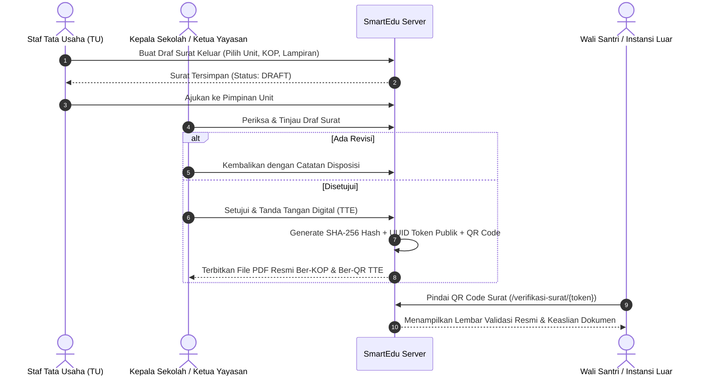

# SmartEdu SIT Robbani — System Architecture (ARCHITECTURE.md)

> **Dokumentasi Cetak Biru Arsitektur Sistem, Alur Data, dan Multi-Tenancy Scoping**

---

## 🏛️ 1. Diagram Arsitektur Tingkat Tinggi (*High-Level Architecture*)

```mermaid
graph TD
    subgraph Klien & Antarmuka Publik
        A1[Browser Desktop] 
        A2[Browser Smartphone / Mobile]
        A3[Chatbot AI Floating Widget]
    end

    subgraph Gerbang Keamanan & Routing
        B1[SecurityHeaders Middleware]
        B2[CSRF Verification]
        B3[301 WordPress Legacy Redirector]
        B4[Auth & Role-Based Middleware]
    end

    subgraph Lapisan Kontroler (MVC Controllers)
        C1[SchoolWebsiteController - Portal & Berita]
        C2[MasterDataController - Siswa, Guru, Unit]
        C3[AcademicController - Rapor, Jadwal, LMS]
        C4[FinanceController - E-SPP, Kasir, Kuitansi]
        C5[LetterController - Persuratan & QR TTE]
        C6[CbtPpdbController - Pendaftaran & Ujian]
    end

    subgraph Lapisan Layanan & Mesin Cerdas
        D1[AiRagEngine - Ingestion PDF & RAG LLM]
        D2[PdfExportEngine - DomPDF Template Renderer]
        D3[SeoEngine - Dynamic XML Sitemap & Robots]
    end

    subgraph Basis Data Terpadu Multi-Tenancy
        E1[(MySQL / SQLite Database)]
        E2[Tabel: schools, users, students, employees]
        E3[Tabel: letters, invoices, payments, cbt_exams]
        E4[Tabel: ai_knowledge_bases, site_settings]
    end

    A1 & A2 & A3 --> B1
    B1 --> B2 & B3 --> B4
    B4 --> C1 & C2 & C3 & C4 & C5 & C6
    C1 & C6 --> D1
    C4 & C5 --> D2
    C1 --> D3
    C1 & C2 & C3 & C4 & C5 & C6 & D1 --> E1
    E1 --- E2 & E3 & E4
```

---

## 🏢 2. Arsitektur Multi-Tenancy Scoping (Isolasi Unit Sekolah)

Sistem menggunakan model **Single Database, Shared Schema with Scoped Queries**:


---

## 📨 3. Siklus Persuratan & Tanda Tangan Elektronik (TTE) Internal



---

## 🧠 4. Alur Mesin AI Knowledge Base RAG (PDF & Live Data)

1. **Ingestion Stage:**
   - Dokumen PDF resmi (Brosur SPMB, SOP Santri, Kurikulum Tahfidz) diunggah oleh admin.
   - `AiRagEngine::extractTextFromPdf()` mengekstrak teks asli dan melakukan tokenisasi kata kunci berbobot.
   - Disimpan pada tabel `ai_knowledge_bases`.
2. **Retrieval Stage:**
   - Pengunjung bertanya di widget chat (misal: *"Berapa biaya masuk dan jadwal tes SDIT?"*).
   - `AiKnowledgeBase::findRelevantKnowledge($query)` menghitung skor relevansi semantik dan mengambil potongan teks dokumen terbaik.
3. **Augmentation & Synthesis Stage:**
   - Prompt digabungkan: `System Islamic Identity` + `Live DB Context (Tahun Ajaran, Unit)` + `RAG Knowledge Snippets` + `User Message`.
   - Dikirim ke Google Gemini API (atau Smart Local Synthesizer jika offline) untuk menghasilkan jawaban presisi dan mencantumkan rujukan dokumen resmi.

---

## 🖥️ 5. Infrastruktur Peladen, Topologi Server & Lingkungan Deployment

Sistem dirancang fleksibel untuk dapat berjalan di beberapa target infrastruktur produksi:

### 5.1. Topologi Standar Produksi (Ubuntu VPS / Dedicated Server)

```mermaid
graph TD
    User([Pengunjung / Wali / Admin]) --> Cloudflare[Cloudflare CDN & WAF / SSL]
    Cloudflare --> Nginx[Nginx Web Server (Reverse Proxy & Static Files)]
    Nginx --> PHP[PHP 8.4-FPM Socket (/run/php/php8.4-fpm.sock)]
    PHP --> Laravel[Laravel Application Core]
    Laravel --> MySQL[(MySQL 8.0 / MariaDB 10.6 Database)]
    Laravel --> Redis[(Redis 7.x Cache & Queue Broker)]
    Supervisor[Supervisor Daemon] --> QueueWorker[php artisan queue:work --tries=3]
    Cron[Linux Crontab] --> Scheduler[php artisan schedule:run]
```

#### Spesifikasi Konfigurasi Server:
1. **Sistem Operasi:** Ubuntu 22.04 LTS atau 24.04 LTS 64-bit.
2. **Web Server Nginx (`/etc/nginx/sites-available/sitrobbani.conf`):**
   ```nginx
   server {
       listen 80;
       server_name sitrobbani.sch.id www.sitrobbani.sch.id;
       return 301 https://$host$request_uri;
   }

   server {
       listen 443 ssl http2;
       server_name sitrobbani.sch.id www.sitrobbani.sch.id;
       root /var/www/smartedu/public;

       ssl_certificate /etc/letsencrypt/live/sitrobbani.sch.id/fullchain.pem;
       ssl_certificate_key /etc/letsencrypt/live/sitrobbani.sch.id/privkey.pem;

       index index.php index.html;
       charset utf-8;
       client_max_body_size 50M;

       # Gzip Compression
       gzip on;
       gzip_types text/plain text/css application/json application/javascript text/xml application/xml;

       location / {
           try_files $uri $uri/ /index.php?$query_string;
       }

       location = /favicon.ico { access_log off; log_not_found off; }
       location = /robots.txt  { access_log off; log_not_found off; }

       error_page 404 /index.php;

       location ~ \.php$ {
           fastcgi_pass unix:/run/php/php8.4-fpm.sock;
           fastcgi_param SCRIPT_FILENAME $realpath_root$fastcgi_script_name;
           include fastcgi_params;
           fastcgi_read_timeout 180;
       }

       location ~ /\.(?!well-known).* {
           deny all;
       }
   }
   ```

### 5.2. Opsi Containerization (Docker Support)
- **`Dockerfile` Multi-Stage:**
  - Base Image: `php:8.4-fpm-alpine`
  - Ekstensi PHP Wajib: `pdo_mysql`, `gd`, `zip`, `opcache`, `bcmath`, `intl`, `exif`.
- **`docker-compose.yml`:**
  - Services: `app` (PHP-FPM), `web` (Nginx), `db` (MySQL 8.0), `redis` (Redis Alpine), `worker` (Queue Supervisor).

### 5.3. Opsi Shared Hosting / cPanel Deployment
- Dokumen root domain diarahkan ke direktori `public_html/public` atau memindahkan konten `public/` ke `public_html/` dengan penyesuaian `require __DIR__.'/../vendor/autoload.php'`.
- Menjalankan `php artisan storage:link` untuk symlink direktori media aset.
- Menambahkan Cron Job cPanel setiap 1 menit:
  `* * * * * /usr/local/bin/php /home/username/public_html/artisan schedule:run >> /dev/null 2>&1`

