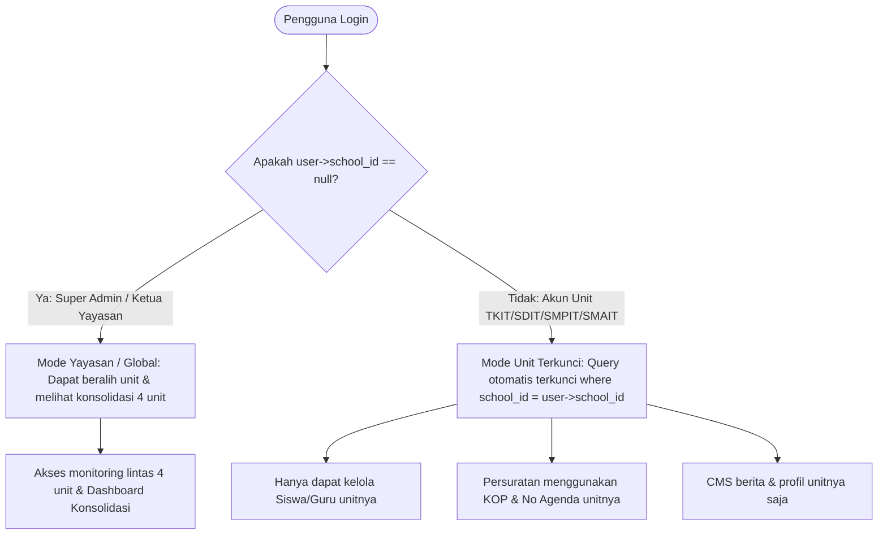
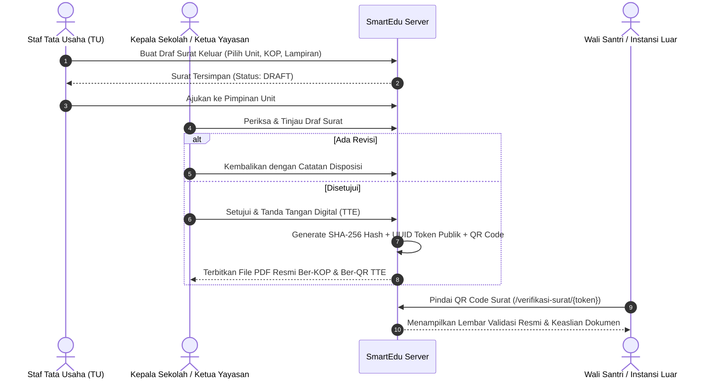

# SmartEdu SIT Robbani — System Architecture (ARCHITECTURE.md)

> **Dokumentasi Cetak Biru Arsitektur Sistem, Alur Data, dan Multi-Tenancy Scoping**

---

## 🏛️ 1. Diagram Arsitektur Tingkat Tinggi (*High-Level Architecture*)

```mermaid
graph TD
    subgraph Klien & Antarmuka Publik
        A1[Browser Desktop] 
        A2[Browser Smartphone / Mobile]
        A3[Chatbot AI Floating Widget]
    end

    subgraph Gerbang Keamanan & Routing
        B1[SecurityHeaders Middleware]
        B2[CSRF Verification]
        B3[301 WordPress Legacy Redirector]
        B4[Auth & Role-Based Middleware]
    end

    subgraph Lapisan Kontroler (MVC Controllers)
        C1[SchoolWebsiteController - Portal & Berita]
        C2[MasterDataController - Siswa, Guru, Unit]
        C3[AcademicController - Rapor, Jadwal, LMS]
        C4[FinanceController - E-SPP, Kasir, Kuitansi]
        C5[LetterController - Persuratan & QR TTE]
        C6[CbtPpdbController - Pendaftaran & Ujian]
    end

    subgraph Lapisan Layanan & Mesin Cerdas
        D1[AiRagEngine - Ingestion PDF & RAG LLM]
        D2[PdfExportEngine - DomPDF Template Renderer]
        D3[SeoEngine - Dynamic XML Sitemap & Robots]
    end

    subgraph Basis Data Terpadu Multi-Tenancy
        E1[(MySQL / SQLite Database)]
        E2[Tabel: schools, users, students, employees]
        E3[Tabel: letters, invoices, payments, cbt_exams]
        E4[Tabel: ai_knowledge_bases, site_settings]
    end

    A1 & A2 & A3 --> B1
    B1 --> B2 & B3 --> B4
    B4 --> C1 & C2 & C3 & C4 & C5 & C6
    C1 & C6 --> D1
    C4 & C5 --> D2
    C1 --> D3
    C1 & C2 & C3 & C4 & C5 & C6 & D1 --> E1
    E1 --- E2 & E3 & E4
```

---

## 🏢 2. Arsitektur Multi-Tenancy Scoping (Isolasi Unit Sekolah)

Sistem menggunakan model **Single Database, Shared Schema with Scoped Queries**:



---

## 📨 3. Siklus Persuratan & Tanda Tangan Elektronik (TTE) Internal



---

## 🧠 4. Alur Mesin AI Knowledge Base RAG (PDF & Live Data)

1. **Ingestion Stage:**
   - Dokumen PDF resmi (Brosur SPMB, SOP Santri, Kurikulum Tahfidz) diunggah oleh admin.
   - `AiRagEngine::extractTextFromPdf()` mengekstrak teks asli dan melakukan tokenisasi kata kunci berbobot.
   - Disimpan pada tabel `ai_knowledge_bases`.
2. **Retrieval Stage:**
   - Pengunjung bertanya di widget chat (misal: *"Berapa biaya masuk dan jadwal tes SDIT?"*).
   - `AiKnowledgeBase::findRelevantKnowledge($query)` menghitung skor relevansi semantik dan mengambil potongan teks dokumen terbaik.
3. **Augmentation & Synthesis Stage:**
   - Prompt digabungkan: `System Islamic Identity` + `Live DB Context (Tahun Ajaran, Unit)` + `RAG Knowledge Snippets` + `User Message`.
   - Dikirim ke Google Gemini API (atau Smart Local Synthesizer jika offline) untuk menghasilkan jawaban presisi dan mencantumkan rujukan dokumen resmi.
