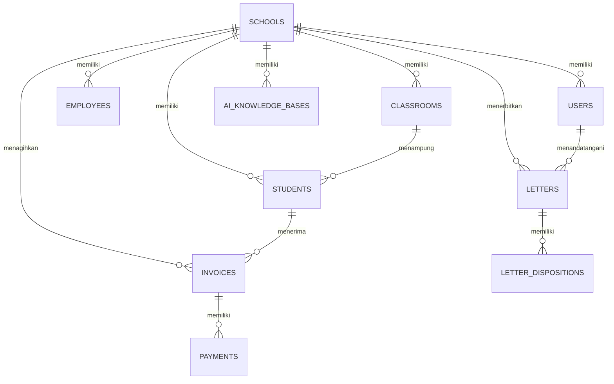

# SmartEdu SIT Robbani — Database Schema (DATABASE_SCHEMA.md)

> **Kamus Data Komprehensif, Struktur Tabel, Tipe Data, dan Relasi Antar-Entitas**

---

## 📊 1. Diagram Relasi Entitas Utama (*Entity Relationship Diagram*)

---

## 🗄️ 2. Spesifikasi Skema Tabel

### 1. `schools` (Master Unit Sekolah & Yayasan)
| Kolom | Tipe Data | Nullable | Keterangan |
| :--- | :--- | :---: | :--- |
| `id` | `BIGINT UNSIGNED` (PK) | NO | ID Unik Unit |
| `code` | `VARCHAR(20)` (UNIQUE) | NO | Kode Unit: `TKIT`, `SDIT`, `SMPIT`, `SMAIT` |
| `name` | `VARCHAR(100)` | NO | Nama resmi unit pendidikan |
| `level` | `ENUM('TK', 'SD', 'SMP', 'SMA')` | NO | Tingkat jenjang pendidikan |
| `principal_name`| `VARCHAR(100)` | YES | Nama Kepala Sekolah aktif |
| `principal_photo`| `VARCHAR(255)` | YES | Path foto profil kepala sekolah |
| `kop_image_url`| `VARCHAR(255)` | YES | URL/Path Banner KOP resmi untuk cetak surat PDF |
| `address` | `TEXT` | YES | Alamat lengkap kampus unit |
| `phone` / `email`| `VARCHAR(50)` | YES | Kontak resmi unit |
| `created_at` / `updated_at` | `TIMESTAMP` | YES | Standar Laravel timestamp |

---

### 2. `users` (Akun Pengguna & Role Authentication)
| Kolom | Tipe Data | Nullable | Keterangan |
| :--- | :--- | :---: | :--- |
| `id` | `BIGINT UNSIGNED` (PK) | NO | ID Akun |
| `school_id` | `BIGINT UNSIGNED` (FK) | YES | `NULL` = Yayasan/Super Admin, `1..4` = Unit Terkunci |
| `role_id` | `VARCHAR(50)` | NO | ID Peran: `SUPER_ADMIN`, `STAFF_TU`, `GURU`, dll. |
| `name` | `VARCHAR(100)` | NO | Nama lengkap pengguna |
| `email` | `VARCHAR(100)` (UNIQUE)| NO | Email login |
| `password` | `VARCHAR(255)` | NO | Bcrypt password hash |
| `is_active` | `TINYINT(1)` | NO | Status aktif (Default: 1) |
| `created_at` / `updated_at` | `TIMESTAMP` | YES | Timestamp |

---

### 3. `students` (Master Data Santri / Siswa)
| Kolom | Tipe Data | Nullable | Keterangan |
| :--- | :--- | :---: | :--- |
| `id` | `BIGINT UNSIGNED` (PK) | NO | ID Santri |
| `school_id` | `BIGINT UNSIGNED` (FK) | NO | Relasi ke tabel `schools` |
| `classroom_id` | `BIGINT UNSIGNED` (FK) | YES | Relasi ke tabel `classrooms` |
| `nis` / `nisn` | `VARCHAR(30)` | YES | Nomor Induk Siswa Nasional |
| `full_name` | `VARCHAR(100)` | NO | Nama lengkap siswa |
| `gender` | `ENUM('L', 'P')` | NO | Jenis Kelamin |
| `parent_name` | `VARCHAR(100)` | YES | Nama orang tua / wali |
| `parent_phone`| `VARCHAR(30)` | YES | No WhatsApp wali santri untuk notifikasi |
| `status` | `ENUM('active','graduated','transferred')` | NO | Status santri (Default: `active`) |

---

### 4. `letters` (Persuratan Resmi & QR TTE)
| Kolom | Tipe Data | Nullable | Keterangan |
| :--- | :--- | :---: | :--- |
| `id` | `BIGINT UNSIGNED` (PK) | NO | ID Surat |
| `school_id` | `BIGINT UNSIGNED` (FK) | YES | Unit pemilik surat |
| `letter_number`| `VARCHAR(100)` | NO | Nomor agenda resmi surat |
| `type` | `ENUM('in', 'out')` | NO | Surat Masuk atau Surat Keluar |
| `subject` | `VARCHAR(255)` | NO | Perihal surat |
| `content` | `LONGTEXT` | YES | Isi surat / draf keputusan |
| `recipient` | `VARCHAR(150)` | YES | Penerima surat |
| `status` | `ENUM('draft', 'review', 'approved', 'rejected')` | NO | Alur disposisi |
| `tte_hash` | `VARCHAR(64)` | YES | SHA-256 digital signature hash |
| `tte_token` | `VARCHAR(36)` (UNIQUE) | YES | UUID 32-char untuk verifikasi scan QR publik |
| `signed_by` | `BIGINT UNSIGNED` (FK) | YES | ID User penandatangan (Kepsek / Ketua Yayasan) |
| `signed_at` | `TIMESTAMP` | YES | Waktu penandatanganan resmi |

---

### 5. `invoices` & `payments` (Keuangan E-SPP & Kuitansi)
- **`invoices`:** `id`, `school_id`, `student_id`, `invoice_number`, `academic_year`, `month`, `total_amount`, `paid_amount`, `status ('unpaid', 'partial', 'paid')`, `due_date`.
- **`payments`:** `id`, `invoice_id`, `school_id`, `payment_number`, `amount`, `payment_method ('cash', 'transfer', 'va')`, `proof_url`, `receipt_token`, `paid_at`.

---

### 6. `ai_knowledge_bases` (Mesin Dokumen RAG Chatbot AI)
| Kolom | Tipe Data | Nullable | Keterangan |
| :--- | :--- | :---: | :--- |
| `id` | `BIGINT UNSIGNED` (PK) | NO | ID Dokumen Pengetahuan |
| `school_id` | `BIGINT UNSIGNED` (FK) | YES | `NULL` = Global Yayasan, `1..4` = Khusus Unit |
| `title` | `VARCHAR(150)` | NO | Judul Dokumen (cth: "Brosur SPMB 2026") |
| `category` | `VARCHAR(50)` | NO | Kategori: `spmb`, `kurikulum`, `sop`, `keuangan` |
| `source_file` | `VARCHAR(255)` | YES | Path file dokumen PDF asli yang diunggah |
| `raw_content` | `LONGTEXT` | NO | Teks lengkap hasil ekstraksi dari file PDF |
| `summary` | `TEXT` | YES | Ringkasan dokumen untuk preview cepat |
| `keywords` | `TEXT` | YES | Kata kunci berbobot untuk semantic matching |
| `is_active` | `TINYINT(1)` | NO | Status aktif pembelajaran AI (Default: 1) |

---

### 7. `site_settings` (Konfigurasi Global & CMS JSON)
- **`site_settings`:** `id`, `key` (UNIQUE), `value` (LONGTEXT / JSON), `group`, `description`.
  - Menyimpan konfigurasi: `hero_title`, `hero_desc`, `hero_badge`, `hero_banner_opacity`, `hero_bg_image`, `principal_photo`, `principal_name`, `principal_greeting`, `social_links`, dll.
