# SmartEdu SIT Robbani — Complete Database Schema (DATABASE_SCHEMA.md)

> **Kamus Data Komprehensif Seluruh 23+ Modul Digital Terintegrasi**  
> **Database Engine:** MySQL 8.0+ / MariaDB 10.6+ / SQLite (Testing)  
> **Collation:** `utf8mb4_unicode_ci`

---

## 📊 1. Diagram Relasi Entitas Makro (*Comprehensive ERD*)

```mermaid
erDiagram
    SCHOOLS ||--o{ USERS : "memiliki"
    SCHOOLS ||--o{ STUDENTS : "memiliki"
    SCHOOLS ||--o{ EMPLOYEES : "memiliki"
    SCHOOLS ||--o{ CLASSROOMS : "memiliki"
    SCHOOLS ||--o{ LETTERS : "menerbitkan"
    SCHOOLS ||--o{ INVOICES : "menagihkan"
    SCHOOLS ||--o{ TAHFIDZ_HALAQAHS : "mengelola"
    SCHOOLS ||--o{ LMS_COURSES : "menyelenggarakan"
    SCHOOLS ||--o{ LIBRARY_BOOKS : "memiliki"
    SCHOOLS ||--o{ SARPRAS_ITEMS : "menginventarisir"
    SCHOOLS ||--o{ CBT_EXAMS : "mengadakan"
    SCHOOLS ||--o{ DORMITORIES : "mengelola"
    SCHOOLS ||--o{ AI_KNOWLEDGE_BASES : "memiliki"

    STUDENTS ||--o{ ATTENDANCES : "mencatat"
    STUDENTS ||--o{ TAHFIDZ_RECORDS : "memiliki_hafalan"
    STUDENTS ||--o{ BPI_MUTABAAHS : "mengisi"
    STUDENTS ||--o{ BK_COUNSELINGS : "menerima"
    STUDENTS ||--o{ BK_VIOLATIONS : "memiliki_pelanggaran"
    STUDENTS ||--o{ BK_ACHIEVEMENTS : "memiliki_prestasi"
    STUDENTS ||--o{ SAVINGS_ACCOUNTS : "memiliki_tabungan"
    STUDENTS ||--o{ CANTEEN_WALLETS : "memiliki_dompet"
    STUDENTS ||--o{ UKS_RECORDS : "memiliki_rekam_medis"
    STUDENTS ||--o{ CBT_EXAM_RESULTS : "mengerjakan"
    STUDENTS ||--o{ REPORT_GRADES : "memperoleh"

    INVOICES ||--o{ PAYMENTS : "memiliki"
    LETTERS ||--o{ LETTER_DISPOSITIONS : "memiliki"
    LIBRARY_BOOKS ||--o{ LIBRARY_LOANS : "dipinjam"
```

---

## 🏛️ 2. Modul Inti & Multi-Tenancy (Unit Scoping)

### 2.1. `schools` (Master Unit Sekolah & Yayasan)
| Kolom | Tipe Data | Keterangan |
| :--- | :--- | :--- |
| `id` | `BIGINT UNSIGNED AUTO_INCREMENT PRIMARY KEY` | ID Unit |
| `code` | `VARCHAR(20) UNIQUE NOT NULL` | `TKIT`, `SDIT`, `SMPIT`, `SMAIT` |
| `name` | `VARCHAR(100) NOT NULL` | Nama Resmi Unit Pendidikan |
| `level` | `ENUM('TK', 'SD', 'SMP', 'SMA') NOT NULL` | Jenjang Pendidikan |
| `principal_name` | `VARCHAR(100) NULL` | Nama Kepala Sekolah |
| `principal_title` | `VARCHAR(100) NULL` | Gelar Jabatan Formal |
| `principal_photo` | `VARCHAR(255) NULL` | Path Foto Kepala Sekolah |
| `kop_image_url` | `VARCHAR(255) NULL` | URL Banner KOP Surat Resmi |
| `npsn` | `VARCHAR(20) NULL` | Nomor Pokok Sekolah Nasional |
| `accreditation` | `VARCHAR(10) DEFAULT 'A'` | Status Akreditasi |
| `address` | `TEXT NULL` | Alamat Kampus |
| `phone` / `email` | `VARCHAR(50) NULL` | Kontak Resmi |
| `created_at` / `updated_at` | `TIMESTAMP NULL` | Standar Timestamp |

### 2.2. `users` (Otentikasi & RBAC 15 Peran)
| Kolom | Tipe Data | Keterangan |
| :--- | :--- | :--- |
| `id` | `BIGINT UNSIGNED AUTO_INCREMENT PRIMARY KEY` | ID Akun |
| `school_id` | `BIGINT UNSIGNED NULL REFERENCES schools(id)` | `NULL` = Super Admin / Yayasan, `1..4` = Unit |
| `role_id` | `VARCHAR(50) NOT NULL` | `SUPER_ADMIN`, `HEADMASTER`, `STAFF_TU`, dll |
| `name` | `VARCHAR(100) NOT NULL` | Nama Pengguna |
| `email` | `VARCHAR(100) UNIQUE NOT NULL` | Email Login |
| `password` | `VARCHAR(255) NOT NULL` | Hash Sandi Bcrypt |
| `rfid_card_number` | `VARCHAR(50) NULL UNIQUE` | Nomor Kartu RFID Fisik |
| `phone` | `VARCHAR(30) NULL` | Nomor WhatsApp |
| `is_active` | `TINYINT(1) DEFAULT 1` | Status Akun Aktif |
| `created_at` / `updated_at` | `TIMESTAMP NULL` | Timestamp |

### 2.3. `academic_years` (Tahun Pelajaran & Semester)
| Kolom | Tipe Data | Keterangan |
| :--- | :--- | :--- |
| `id` | `BIGINT UNSIGNED AUTO_INCREMENT PRIMARY KEY` | ID TA |
| `name` | `VARCHAR(50) NOT NULL` | Contoh: `2026/2027` |
| `semester` | `ENUM('ganjil', 'genap') NOT NULL` | Semester Berjalan |
| `start_date` / `end_date` | `DATE NOT NULL` | Periode Semester |
| `is_active` | `TINYINT(1) DEFAULT 0` | Hanya 1 TA yang aktif |
| `created_at` / `updated_at` | `TIMESTAMP NULL` | Timestamp |

### 2.4. `classrooms` (Rombongan Belajar / Kelas)
| Kolom | Tipe Data | Keterangan |
| :--- | :--- | :--- |
| `id` | `BIGINT UNSIGNED AUTO_INCREMENT PRIMARY KEY` | ID Kelas |
| `school_id` | `BIGINT UNSIGNED NOT NULL REFERENCES schools(id)` | Unit Pemilik Kelas |
| `academic_year_id` | `BIGINT UNSIGNED NOT NULL REFERENCES academic_years(id)`| Tahun Ajaran |
| `name` | `VARCHAR(50) NOT NULL` | Contoh: `7A Abu Bakar`, `12 IPA 1` |
| `grade_level` | `INT NOT NULL` | Jenjang Kelas (1-12) |
| `homeroom_teacher_id` | `BIGINT UNSIGNED NULL REFERENCES employees(id)` | Wali Kelas |
| `created_at` / `updated_at` | `TIMESTAMP NULL` | Timestamp |

### 2.5. `students` (Master Data Santri)
| Kolom | Tipe Data | Keterangan |
| :--- | :--- | :--- |
| `id` | `BIGINT UNSIGNED AUTO_INCREMENT PRIMARY KEY` | ID Santri |
| `school_id` | `BIGINT UNSIGNED NOT NULL REFERENCES schools(id)` | Unit Santri |
| `classroom_id` | `BIGINT UNSIGNED NULL REFERENCES classrooms(id)` | Kelas Aktif |
| `nis` | `VARCHAR(30) UNIQUE NULL` | Nomor Induk Santri |
| `nisn` | `VARCHAR(30) UNIQUE NULL` | NISN Kemendikbud |
| `rfid_tag` | `VARCHAR(50) UNIQUE NULL` | Tag RFID Santri |
| `full_name` | `VARCHAR(100) NOT NULL` | Nama Lengkap |
| `gender` | `ENUM('L', 'P') NOT NULL` | Jenis Kelamin |
| `pob` / `dob` | `VARCHAR(50) / DATE NULL` | Tempat, Tanggal Lahir |
| `parent_name` | `VARCHAR(100) NULL` | Nama Ayah / Ibu / Wali |
| `parent_phone` | `VARCHAR(30) NULL` | No WA Wali untuk Notifikasi Billing & Absen |
| `status` | `ENUM('active', 'graduated', 'transferred') DEFAULT 'active'` | Status Santri |
| `created_at` / `updated_at` | `TIMESTAMP NULL` | Timestamp |

### 2.6. `employees` (Pendidik & Tenaga Kependidikan)
| Kolom | Tipe Data | Keterangan |
| :--- | :--- | :--- |
| `id` | `BIGINT UNSIGNED AUTO_INCREMENT PRIMARY KEY` | ID Pegawai |
| `school_id` | `BIGINT UNSIGNED NOT NULL REFERENCES schools(id)` | Unit Homebase |
| `user_id` | `BIGINT UNSIGNED NULL REFERENCES users(id)` | Akun Login Pegawai |
| `nip` | `VARCHAR(30) UNIQUE NULL` | Nomor Induk Pegawai |
| `full_name` | `VARCHAR(100) NOT NULL` | Nama Lengkap & Gelar |
| `position` | `VARCHAR(100) NOT NULL` | Guru Mapel / TU / Musyrif / Kasir |
| `employment_status` | `ENUM('tetap', 'kontrak', 'honor') DEFAULT 'tetap'` | Status Kepegawaian |
| `phone` / `email` | `VARCHAR(50) NULL` | Kontak |
| `base_salary` | `DECIMAL(12,2) DEFAULT 0` | Gaji Pokok |
| `created_at` / `updated_at` | `TIMESTAMP NULL` | Timestamp |

---

## 💳 3. Modul Keuangan & Billing (E-SPP, Kasir & Tabungan)

### 3.1. `payment_posts` (Pos Tagihan Keuangan)
| Kolom | Tipe Data | Keterangan |
| :--- | :--- | :--- |
| `id` | `BIGINT UNSIGNED AUTO_INCREMENT PRIMARY KEY` | ID Pos |
| `school_id` | `BIGINT UNSIGNED NOT NULL REFERENCES schools(id)` | Unit Sekolah |
| `name` | `VARCHAR(100) NOT NULL` | Contoh: `SPP Bulanan`, `Uang Gedung`, `Buku` |
| `type` | `ENUM('recurring', 'one_time') DEFAULT 'recurring'` | Rutin Bulanan / Sekali Bayar |
| `default_amount` | `DECIMAL(12,2) NOT NULL` | Besaran Tarif Standar |

### 3.2. `invoices` (Faktur Tagihan Santri)
| Kolom | Tipe Data | Keterangan |
| :--- | :--- | :--- |
| `id` | `BIGINT UNSIGNED AUTO_INCREMENT PRIMARY KEY` | ID Faktur |
| `school_id` | `BIGINT UNSIGNED NOT NULL REFERENCES schools(id)` | Unit |
| `student_id` | `BIGINT UNSIGNED NOT NULL REFERENCES students(id)` | Santri Tertagih |
| `payment_post_id`| `BIGINT UNSIGNED NOT NULL REFERENCES payment_posts(id)` | Pos Tagihan |
| `invoice_number` | `VARCHAR(50) UNIQUE NOT NULL` | Contoh: `INV-202608-SDIT-0042` |
| `month` / `year` | `INT / INT NOT NULL` | Periode Tagihan Bulan/Tahun |
| `total_amount` | `DECIMAL(12,2) NOT NULL` | Total Tagihan |
| `paid_amount` | `DECIMAL(12,2) DEFAULT 0` | Jumlah Terbayar |
| `status` | `ENUM('unpaid', 'partial', 'paid') DEFAULT 'unpaid'` | Status Lunas |
| `due_date` | `DATE NOT NULL` | Batas Waktu Bayar |
| `created_at` / `updated_at` | `TIMESTAMP NULL` | Timestamp |

### 3.3. `payments` (Transaksi Pembayaran & Kuitansi PDF)
| Kolom | Tipe Data | Keterangan |
| :--- | :--- | :--- |
| `id` | `BIGINT UNSIGNED AUTO_INCREMENT PRIMARY KEY` | ID Bayar |
| `invoice_id` | `BIGINT UNSIGNED NOT NULL REFERENCES invoices(id)` | Faktur Terkait |
| `school_id` | `BIGINT UNSIGNED NOT NULL REFERENCES schools(id)` | Unit |
| `payment_number` | `VARCHAR(50) UNIQUE NOT NULL` | Contoh: `PAY-20260816-0081` |
| `amount` | `DECIMAL(12,2) NOT NULL` | Nominal Bayar |
| `payment_method` | `ENUM('cash', 'transfer', 'va', 'qris') NOT NULL` | Saluran Bayar |
| `gateway_ref` | `VARCHAR(100) NULL` | ID Transaksi Midtrans / Xendit |
| `receipt_token` | `VARCHAR(36) UNIQUE NOT NULL` | UUID Validasi Scan QR Kuitansi |
| `received_by` | `BIGINT UNSIGNED NULL REFERENCES users(id)` | Kasir Penerima |
| `paid_at` | `TIMESTAMP NOT NULL` | Waktu Bayar |

### 3.4. `savings_accounts` & `savings_transactions` (Tabungan Santri)
- **`savings_accounts`:** `id`, `school_id`, `student_id` (UNIQUE), `account_number`, `balance` (DECIMAL 12,2), `status`.
- **`savings_transactions`:** `id`, `savings_account_id`, `type ('deposit', 'withdraw')`, `amount`, `balance_after`, `description`, `created_by`.

### 3.5. `canteen_wallets` & `canteen_transactions` (Dompet Digital & Kantin POS)
- **`canteen_wallets`:** `id`, `student_id` (UNIQUE), `balance` (DECIMAL 12,2), `daily_limit` (DECIMAL 12,2), `pin_hash`.
- **`canteen_transactions`:** `id`, `canteen_wallet_id`, `cashier_id`, `total_amount`, `items_json`, `created_at`.

---

## 📖 4. Modul Kepesantrenan, Tahfidz & BPI

### 4.1. `tahfidz_halaqahs` & `tahfidz_records` (Tahfidz Tracker)
- **`tahfidz_halaqahs`:** `id`, `school_id`, `name` (cth: "Halaqah Ali Bin Abi Thalib"), `teacher_id` (Musyrif), `academic_year_id`.
- **`tahfidz_records`:**
  | Kolom | Tipe Data | Keterangan |
  | :--- | :--- | :--- |
  | `id` | `BIGINT UNSIGNED AUTO_INCREMENT PRIMARY KEY` | ID Setoran |
  | `student_id` | `BIGINT UNSIGNED NOT NULL REFERENCES students(id)` | Santri |
  | `halaqah_id` | `BIGINT UNSIGNED NOT NULL REFERENCES tahfidz_halaqahs(id)` | Kelompok Halaqah |
  | `type` | `ENUM('ziyadah', 'murajaah') NOT NULL` | Setoran Baru / Ulang |
  | `surah_number` | `INT NOT NULL` | Nomor Surah (1-114) |
  | `ayah_start` / `ayah_end` | `INT / INT NOT NULL` | Rentang Ayat |
  | `juz` | `INT NOT NULL` | Juz (1-30) |
  | `grade` | `ENUM('A', 'B', 'C', 'D') DEFAULT 'A'` | Mutu Kelancaran |
  | `notes` | `TEXT NULL` | Catatan Tajwid & Makhraj |
  | `date` | `DATE NOT NULL` | Tanggal Setoran |

### 4.2. `bpi_groups` & `bpi_mutabaahs` (Bina Pribadi Islam & Yaumiyah)
- **`bpi_groups`:** `id`, `school_id`, `name`, `mentor_id`, `level`.
- **`bpi_mutabaahs`:**
  | Kolom | Tipe Data | Keterangan |
  | :--- | :--- | :--- |
  | `id` | `BIGINT UNSIGNED AUTO_INCREMENT PRIMARY KEY` | ID Mutabaah |
  | `student_id` | `BIGINT UNSIGNED NOT NULL REFERENCES students(id)` | Santri |
  | `date` | `DATE NOT NULL` | Tanggal Catatan |
  | `sholat_fardhu_jamaah` | `TINYINT UNSIGNED DEFAULT 5` | Jumlah Sholat Berjamaah (0-5) |
  | `sholat_dhuha` | `TINYINT(1) DEFAULT 0` | Sholat Dhuha (0/1) |
  | `sholat_tahajjud` | `TINYINT(1) DEFAULT 0` | Sholat Tahajjud (0/1) |
  | `tilawah_pages` | `INT DEFAULT 0` | Lembar Tilawah Al-Qur'an |
  | `al_matsurat` | `ENUM('none', 'pagi', 'petang', 'lengkap')` | Dzikir Pagi Petang |
  | `puasa_sunnah` | `TINYINT(1) DEFAULT 0` | Shaum Sunnah |
  | `verified_by_musyrif` | `TINYINT(1) DEFAULT 0` | Verifikasi Pembina |

---

## 📚 5. Modul E-Learning (LMS) & Perpustakaan (E-Library)

### 5.1. `lms_courses`, `lms_materials` & `lms_assignments`
- **`lms_courses`:** `id`, `school_id`, `classroom_id`, `subject_id`, `teacher_id`, `title`, `description`.
- **`lms_materials`:** `id`, `course_id`, `title`, `content_type ('text', 'pdf', 'youtube', 'file')`, `file_url`, `published_at`.
- **`lms_assignments`:** `id`, `course_id`, `title`, `instructions`, `due_date`, `max_score`.
- **`lms_submissions`:** `id`, `assignment_id`, `student_id`, `file_url`, `student_note`, `score`, `teacher_feedback`, `submitted_at`.

### 5.2. `library_books`, `library_categories` & `library_loans` (E-Library)
- **`library_categories`:** `id`, `name`, `code`.
- **`library_books`:** `id`, `school_id`, `category_id`, `isbn`, `title`, `author`, `publisher`, `year`, `total_copies`, `available_copies`, `cover_image`.
- **`library_loans`:** `id`, `school_id`, `book_id`, `student_id`, `loan_date`, `due_date`, `return_date`, `fine_amount`, `status ('borrowed', 'returned', 'overdue')`.

---

## 🏥 6. Modul Asrama, UKS, Konseling (BK) & Sarpras

### 6.1. `dormitories`, `dormitory_rooms` & `dormitory_residents` (Asrama)
- **`dormitories`:** `id`, `school_id`, `name` (cth: "Gedung Asrama Al-Fatih"), `gender ('L', 'P')`, `musyrif_id`.
- **`dormitory_rooms`:** `id`, `dormitory_id`, `room_number`, `capacity`, `current_occupancy`.
- **`dormitory_residents`:** `id`, `dormitory_room_id`, `student_id`, `check_in_date`, `check_out_date`, `status`.

### 6.2. `uks_records` (Klinik & Rekam Medis Santri)
- **`uks_records`:** `id`, `school_id`, `student_id`, `date`, `symptoms`, `diagnosis`, `treatment`, `medicines_given`, `is_rest_at_uks`, `recorded_by`.

### 6.3. `bk_counselings`, `bk_violations` & `bk_achievements` (Bimbingan Konseling)
- **`bk_counselings`:** `id`, `school_id`, `student_id`, `counselor_id`, `date`, `problem_category`, `summary`, `action_plan`, `is_confidential`.
- **`bk_violations`:** `id`, `school_id`, `student_id`, `violation_name`, `points` (cth: 15), `penalty`, `date`, `reported_by`.
- **`bk_achievements`:** `id`, `school_id`, `student_id`, `achievement_name`, `level ('kabupaten', 'provinsi', 'nasional', 'internasional')`, `points` (cth: +50), `date`.

### 6.4. `sarpras_items` & `facility_rentals` (Aset & Sewa Fasilitas)
- **`sarpras_items`:** `id`, `school_id`, `item_code`, `name`, `category`, `location_room`, `condition ('baik', 'rusak_ringan', 'rusak_berat')`, `quantity`.
- **`facility_rentals`:** `id`, `facility_name`, `renter_name`, `renter_phone`, `event_date`, `start_time`, `end_time`, `rental_fee`, `status ('pending', 'approved', 'rejected')`.

---

## 🎯 7. Modul CBT, PPDB, Persuratan & AI RAG

### 7.1. `cbt_exams`, `cbt_questions` & `cbt_results`
- **`cbt_exams`:** `id`, `school_id`, `title` (cth: "Tes Akademik SPMB 2026"), `type ('spmb', 'uts', 'uas')`, `duration_minutes`, `start_time`, `end_time`, `is_active`.
- **`cbt_questions`:** `id`, `cbt_exam_id`, `question_text`, `image_url`, `option_a`, `option_b`, `option_c`, `option_d`, `correct_option ('A','B','C','D')`, `score_weight`.
- **`cbt_results`:** `id`, `cbt_exam_id`, `student_id` (atau `spmb_applicant_id`), `total_score`, `answers_json`, `status ('passed', 'failed')`, `completed_at`.

### 7.2. `letters` & `letter_dispositions` (Persuratan & TTE)
- **`letters`:** `id`, `school_id`, `letter_number`, `type ('in', 'out')`, `subject`, `content`, `recipient`, `status ('draft', 'review', 'approved', 'rejected')`, `tte_hash` (SHA-256), `tte_token` (UUID), `signed_by`, `signed_at`.
- **`letter_dispositions`:** `id`, `letter_id`, `from_user_id`, `to_user_id`, `instruction_note`, `status`, `created_at`.

### 7.3. `ai_knowledge_bases` (Mesin RAG Dokumen Chatbot AI)
- **`ai_knowledge_bases`:**
  - `id` (BIGINT UNSIGNED PK)
  - `school_id` (BIGINT UNSIGNED NULL)
  - `title` (VARCHAR 150)
  - `category` (`spmb`, `kurikulum`, `sop`, `keuangan`)
  - `source_file` (VARCHAR 255 Path PDF)
  - `raw_content` (LONGTEXT Teks Ekstraksi)
  - `summary` (TEXT)
  - `keywords` (TEXT Bobot Kata Kunci)
  - `is_active` (TINYINT 1)

### 7.4. `site_settings` (Konfigurasi Global & CMS)
- **`site_settings`:** `id`, `key` (UNIQUE), `value` (LONGTEXT), `group`, `description`.
