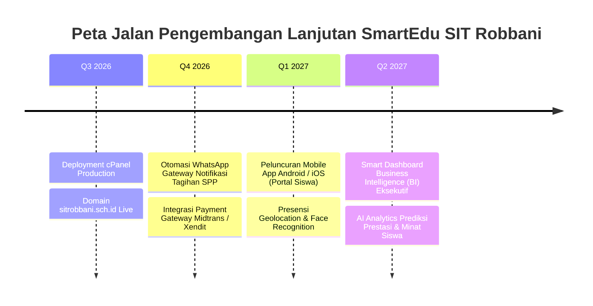

# SmartEdu SIT Robbani — Roadmap & Milestones (ROADMAP.md)

> **Rencana Pengembangan, Status Rilis Fitur, dan Rencana Masa Depan Sistem SmartEdu**
> *Terakhir diperbarui: 17 Agustus 2026*

---

## 📅 1. Riwayat Tahapan Rilis (*Completed Milestones*)

### ✅ Fase 1: Fondasi ERP & Multi-Tenancy Scoping
- Implementasi 15 Peran Pengguna (*Role-Based Access Control*).
- Isolasi data unit pendidikan (`school_id: 1..4` untuk TKIT, SDIT, SMPIT, SMAIT dan `school_id: null` untuk Yayasan).
- Modul Master Data Siswa, Guru, Kelas, dan Tahun Ajaran.
- Modul Keuangan E-SPP, Kasir POS, dan Cetak Kuitansi PDF.

### ✅ Fase 2: Integrasi Konten Asli & Multimedia
- Parser XML WordPress super cepat (247 postingan berita asli termuat dalam 0.1 detik).
- Integrasi video resmi YouTube Channel SIT Robbani dengan pemutar modal interaktif.
- Auto-kategorisasi berita ke masing-masing profil unit.

### ✅ Fase 3: Persuratan Digital & Tanda Tangan Elektronik (TTE)
- Pembuatan draf surat keluar dengan banner KOP unit resmi atau mode logo tunggal.
- Alur disposisi dan verifikasi pimpinan unit/yayasan.
- Penandatanganan digital ber-QR dengan enkripsi SHA-256 dan token UUID publik (`/verifikasi-surat/{token}`).

### ✅ Fase 4: Dark Mode Eksekutif (Obsidian Emerald & Electric Lemon)
- Transisi tema satu klik dengan Alpine.js state persistence (`darkMode: true/false`).
- Warna `#061107` (Deep Obsidian Emerald) dan `#c6f634` (Electric Lemon).
- Kepatuhan kontras WCAG AAA (teks hitam pekat di atas tombol neon lime).

### ✅ Fase 5: Redesain Berita 2-Kolom, Migrasi SEO 301 & Keamanan Siber
- Pembagian layout berita 2-kolom desktop (konten lebar di kiri, widget pencarian & navigasi di kanan).
- Dynamic XML Sitemap (`/sitemap.xml`) dengan Google Image tags & priority.
- Dynamic `robots.txt` (`/robots.txt`).
- Handler 301 Permanent Redirect untuk seluruh URL warisan WordPress.
- Structured data Schema.org JSON-LD (`NewsArticle` dan `EducationalOrganization`).
- Global Security Headers Middleware (`X-Frame-Options`, `X-Content-Type-Options`, `X-XSS-Protection`, `Referrer-Policy`).

### ✅ Fase 6: Modul 23 AI Chatbot RAG, Perbaikan Mobile & Animasi Fast Fade-Up
- Penambahan Kategori 6: **Smart AI & RAG Dokumen** di showcase digital web utama.
- Ekstraksi otomatis teks dokumen PDF resmi ke tabel `ai_knowledge_bases`.
- RAG terintegrasi data realtime database SmartEdu.
- Perbaikan layout mobile widget jadwal sholat 5-kolom simetris bebas tumpang-tindih.
- Animasi scroll cepat dan halus (`.reveal-fade-up` durasi 0.4s).
- Chatbot AI dengan typing animation (karakter per karakter).

### ✅ Fase 7: Perbaikan Data Real & Hardening Keamanan Pre-Production
- Data guru semua unit (TKIT, SDIT, SMPIT) diperbarui dari backup XML WordPress dengan nama, jabatan, dan foto real.
- **Fix keamanan kritis:** Seluruh endpoint API mobile dilindungi `auth:sanctum` middleware.
- Kepala sekolah semua unit diperbarui ke data kepemimpinan real (Nur Amalia, Tia Wulandari, Ani Oktar Yansi).
- Build Vite asset produksi (`public/build/`) disiapkan untuk deployment cPanel tanpa Node.js.
- Template `.env.cpanel`, `deploy.sh`, dan `cpanel_setup.php` disiapkan.
- Export database MySQL dari SQLite: `scratch/mysql_FINAL_sitrobbani.sql` (57 tabel, 1133+ rows).

---

## 🔮 2. Rencana Pengembangan Selanjutnya (*Future Horizons*)

### Rincian Rencana:
1. **Deployment cPanel Production (Q3 2026):**
   - Upload ke cPanel via Git Version Control.
   - Import MySQL database final.
   - Konfigurasi DocumentRoot ke `/public`, PHP 8.4, SSL aktif.
2. **Otomasi Notifikasi Tagihan SPP via WhatsApp Gateway:**
   - Kirim pengingat tagihan bulanan otomatis ke nomor WhatsApp wali murid setiap tanggal 1.
3. **Integrasi Virtual Account & QRIS Payment Gateway:**
   - Pembayaran SPP instan via BCA, Mandiri, BSI, dan QRIS dengan notifikasi webhook lunas realtime.
4. **Mobile App Portal Siswa & Wali (v2):**
   - Aplikasi mobile native untuk wali murid memantau mutabaah harian, presensi, hafalan tahfidz, dan saldo saku siswa.
5. **AI Smart Assessment & Student Analytics:**
   - Rekomendasi program peningkatan minat bakat siswa berdasarkan data mutabaah, rapor, dan catatan konseling BK.
