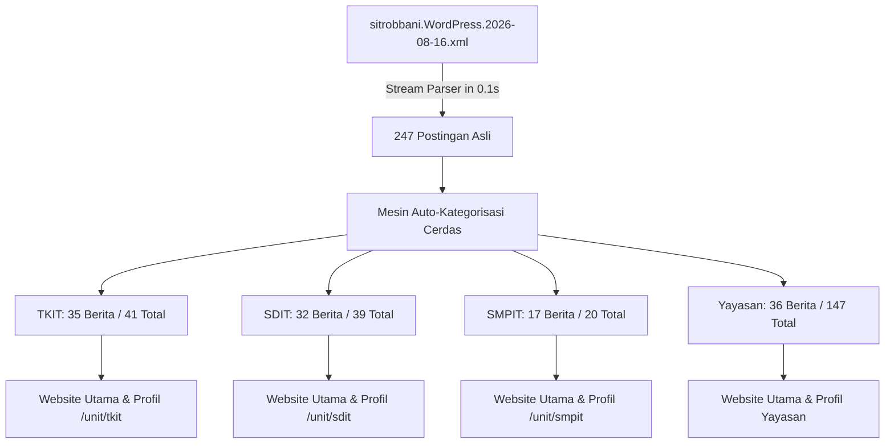

# SmartEdu SIT Robbani Ogan Ilir — Comprehensive Implementation & Architecture Plan

Dokumen ini merupakan panduan master arsitektur, alur kerja sistem, hierarki data, dan status implementasi terkini dari platform **SmartEdu SIT Robbani Ogan Ilir**. Dokumen ini dirancang agar setiap *programmer*, *developer*, maupun *AI Agent* selanjutnya dapat langsung memahami seluruh sistem secara komprehensif tanpa ambiguitas.

---

## 📌 1. Gambaran Umum & Stack Teknologi

| Komponen | Spesifikasi / Teknologi | Keterangan |
| :--- | :--- | :--- |
| **Framework Backend** | **Laravel (PHP 8.4+)** | MVC, Eloquent ORM, Blade Templating Engine |
| **Frontend & UI** | **Tailwind CSS + Alpine.js** | Desain modern, responsive, interaktif tanpa reload berat |
| **Notifikasi Global** | **SweetAlert2 (Timer Auto-Close)** | Notifikasi alert konsisten di seluruh sistem admin & web |
| **Ekspor Dokumen & PDF** | **Barryvdh DomPDF + Simple QrCode** | Cetak Bukti Pembayaran, Kuitansi SPP, Surat Resmi Ber-KOP, QR TTE |
| **Basis Data** | **MySQL / SQLite Support** | Relasi multi-tenancy dengan kolom `school_id` |
| **Media & Branding** | **WebP / PNG Compressed (<100KB)** | Logo resmi TKIT, SDIT, SMPIT, SMAIT terkompresi |
| **Integrasi Eksternal** | **WordPress XML Parser & YouTube API/oEmbed** | 247 postingan berita riil & video resmi channel SIT Robbani |

---

## 🏛️ 2. Struktur Organisasi & Multi-Tenancy (Unit Scoping)

Sistem mengelola 4 unit pendidikan di bawah naungan 1 yayasan induk:
1. **Yayasan Generasi Robbani Ogan Ilir** (Yayasan Induk / Global Oversight)
2. **KB/TKIT Robbani** (`code: TKIT`, `school_id: 1`)
3. **SDIT Robbani** (`code: SDIT`, `school_id: 2`)
4. **SMPIT Robbani** (`code: SMPIT`, `school_id: 3`)
5. **SMAIT Robbani** (`code: SMAIT`, `school_id: 4`)

### Aturan Isolasi Data (*Data Scoping Rules*):
- **Akun Unit (`user->school_id != null`):**
  - Data terkunci 100% pada unit sekolahnya.
  - Query otomatis menerapkan `where('school_id', $user->school_id)`.
  - Switcher unit di sidebar terkunci dengan status: `🏫 Unit: [Nama Unit] (Terkunci)`.
  - Unit user dilarang melihat, mengedit, atau menghapus data milik unit lain.
- **Akun Yayasan (`user->school_id == null`):**
  - Khusus `SUPER_ADMIN` dan `YAYASAN_CHAIRMAN`.
  - Memiliki akses monitoring lintas unit dan dapat beralih unit menggunakan switcher dashboard (`session('dashboard_school_id')`).

---

## 👥 3. Matriks Role-Based Access Control (15 Peran)

Sistem memiliki 15 peran pengguna (*roles*) dengan pembagian tugas yang tegas:

| No | Role ID | Nama Peran | Lingkup Akses & Modul Utama |
| :---: | :--- | :--- | :--- |
| 1 | `SUPER_ADMIN` | 👑 Super Admin IT | Seluruh modul sistem, konfigurasi server, manajemen akun, CMS, DB |
| 2 | `YAYASAN_CHAIRMAN` | 🏛️ Ketua Yayasan | Dashboard eksekutif konsolidasi, persuratan/disposisi, laporan keuangan |
| 3 | `HEADMASTER` (TKIT) | 🏫 Kepala Sekolah TKIT | Manajemen akademik, guru, siswa, persuratan, approval unit TKIT |
| 4 | `HEADMASTER` (SDIT) | 🏫 Kepala Sekolah SDIT | Manajemen akademik, guru, siswa, persuratan, approval unit SDIT |
| 5 | `HEADMASTER` (SMPIT) | 🏫 Kepala Sekolah SMPIT | Manajemen akademik, guru, siswa, persuratan, approval unit SMPIT |
| 6 | `HEADMASTER` (SMAIT) | 🏫 Kepala Sekolah SMAIT | Manajemen akademik, guru, siswa, persuratan, approval unit SMAIT |
| 7 | `STAFF_TU` | 📋 Tata Usaha (TU) | Persuratan masuk/keluar, buku agenda, data siswa/guru, **CMS Profil Unit** |
| 8 | `STAFF_KEUANGAN` | 💰 Bendahara / Keuangan | Tagihan SPP, pos pembayaran, kasir POS, tabungan siswa, payroll gaji |
| 9 | `GURU` | 👨‍🏫 Dewan Guru | E-Learning/LMS, jurnal mengajar, absensi harian, penilaian rapor |
| 10 | `GURU_BK` | 👥 Guru BK (Konseling) | Konseling siswa, catatan pelanggaran & poin prestasi, mutabaah |
| 11 | `MUSYRIF` | 🕌 Pembina Asrama / Musyrif | Pembinaan Bina Pribadi Islam (BPI), mutabaah yaumiyah, tahfidz asrama |
| 12 | `PUSTAKAWAN` | 📚 Pustakawan | Katalog E-Library, sirkulasi peminjaman/pengembalian buku, denda |
| 13 | `KASIR_KANTIN` | 🍽️ Kasir Kantin RFID | Transaksi POS kantin non-tunai, riwayat belanja santri |
| 14 | `PANITIA_PPDB` | 🎯 Panitia PPDB & CBT | Pendaftaran santri baru, verifikasi berkas, bank soal CBT, pengumuman |
| 15 | `SARPRAS` | 🏢 Petugas Sarpras & Aset | Inventarisasi aset, pemeliharaan ruangan, peminjaman barang |

---

## 📨 4. Alur Persuratan Resmi & Tanda Tangan Elektronik (TTE) Internal

```mermaid
flowchart TD
    A[Staf TU: Buat Draft Surat Keluar] --> B[Simpan & Masuk Antrian Verifikasi]
    B --> C{Pimpinan Unit / Yayasan}
    C -->|Revisi / Disposisi| D[Staf TU: Edit Draf & Kirim Ulang]
    D --> B
    C -->|Setujui & TTE Digital| E[Generate SHA-256 Hash + Token Publik + Secure QR]
    E --> F[Terbitkan Surat Resmi Ber-KOP PDF]
    F --> G[Verifikasi Publik: /verifikasi-surat/{token}]
```

1. **Format KOP Surat Resmi:**
   - Opsi 1: Mode Logo Tunggal di tengah atas.
   - Opsi 2: Mode Banner KOP Unit resmi dengan informasi kontak dan akreditasi.
2. **Keamanan TTE Digital Internal:**
   - Hash SHA-256 dibuat dari kombinasi ID surat, nomor agenda, tanggal terbit, dan identitas penandatangan.
   - Dilengkapi Token Unik UUID 32 karakter untuk verifikasi publik instan via scan QR.

---

## 🌐 5. Website Publik & Integrasi Konten WordPress Asli



### Fitur CMS & Website:
1. **Website Utama (`/`):** Menampilkan berita terkini berurutan dari tahun 2026 terbaru, tab filter interaktif unit, video dokumentasi, fasilitas, dan pendaftaran SPMB.
2. **Halaman Unit (`/unit/{code}`):** Profil lengkap masing-masing unit (`tkit`, `sdit`, `smpit`, `smait`) dengan sambutan kepala sekolah, visi-misi, kurikulum, dan seksi berita khusus unit terkait.
3. **Pengelolaan Profil Unit oleh TU:** Staf TU unit dapat login dan langsung memperbarui informasi website unitnya tanpa mengganggu unit lain (`/admin/settings/units/{code}/edit`).
4. **Portal Berita (`/berita`):** Pencarian, filter per unit, dan tampilan detail berita lengkap dengan gambar resolusi penuh.

---

## 🎥 6. Integrasi Video YouTube Resmi (@sitrobbanioganilir8496)

Seluruh video demo telah dibersihkan. Sistem terhubung langsung dengan Channel Resmi **YouTube SIT Robbani Ogan Ilir**:
- Jingle Resmi SIT Robbani Ogan Ilir (`Q-vZ49vP1_c`)
- After Movie MPLS SIT Robbani (`8yp0GZL27fU`)
- Wisuda Tahfidz & Haflah Akhirussanah (`lhFR6TrEWxY`)
- Dokumentasi Manasik Haji KB/TKIT (`5ifsHX2orZ8`), Qur'an Camp SDIT (`ug0lt6LlYSs`), Robbani Talent Show SMPIT (`cCRXQhYNF38`), dll.
- Pemutar video modal interaktif dengan embed HD langsung dari YouTube.

---

## 📁 7. Peta Controller & Model Utama

```
app/
├── Http/
│   ├── Controllers/
│   │   ├── Admin/
│   │   │   ├── AcademicController.php      # Akademik, Jadwal, Penilaian Rapor
│   │   │   ├── AttendanceController.php    # Presensi Siswa & Karyawan
│   │   │   ├── BkController.php            # Konseling BK & Poin Pelanggaran
│   │   │   ├── BpiController.php           # Bina Pribadi Islam & Mutabaah
│   │   │   ├── CanteenController.php       # Transaksi Kantin RFID
│   │   │   ├── CbtPpdbController.php       # CBT Online & Seleksi PPDB
│   │   │   ├── CmsController.php           # CMS Web, Berita, Unit, Parser XML
│   │   │   ├── FinanceController.php       # SPP, Pos Bayar, Laporan Kasir
│   │   │   ├── HrisPayrollController.php   # Data Pegawai & Penggajian
│   │   │   ├── LetterController.php        # Persuratan, Disposisi & TTE
│   │   │   ├── LibraryController.php       # Perpustakaan E-Library
│   │   │   ├── LmsController.php           # Materi E-Learning & Tugas
│   │   │   ├── MasterDataController.php    # Data Siswa, Guru, Kelas, Rombel
│   │   │   ├── SarprasController.php       # Inventaris & Peminjaman Sarpras
│   │   │   ├── SavingsController.php       # Tabungan Santri
│   │   │   └── UserController.php          # Manajemen 15 Akun & Hak Akses
│   │   └── SchoolWebsiteController.php     # Frontend Web Utama, Unit, Berita
│   └── Middleware/
│       ├── CheckRole.php                   # RBAC Role Gatekeeper
│       └── EnsureUnitAccess.php            # Data Scoping Gatekeeper
└── Models/
    ├── School.php                          # Master Unit Sekolah
    ├── User.php                            # Akun Pengguna & Roles
    ├── Student.php, Employee.php           # Data Siswa & Karyawan
    ├── Letter.php, LetterDisposition.php   # Persuratan & TTE
    ├── Invoice.php, Payment.php            # Keuangan & Transaksi SPP
    └── SiteSetting.php                     # Konfigurasi Global & CMS JSON
```

---

## 🧪 8. Panduan Eksekusi Automated Test Suite

Untuk memverifikasi keutuhan sistem kapan saja, jalankan script verifikasi mandiri berikut:

```bash
# 1. Verifikasi Seluruh Modul Sistem (22 Modul)
php scratch/test_all_features.php

# 2. Verifikasi Isolasi Data Unit & Akses TU
php scratch/test_unit_scoping.php

# 3. Verifikasi RBAC 15 Peran Pengguna
php scratch/test_rbac_and_roles.php

# 4. Verifikasi Persuratan, Disposisi & TTE
php scratch/test_letters_and_tte.php

# 5. Verifikasi Manajemen Akun Pengguna
php scratch/test_user_management.php

# 6. Verifikasi Auto-Kategorisasi Konten WordPress 2026
php scratch/test_cms_auto_cat.php

# 7. Verifikasi Tampilan Berita Real Unit di Frontend
php scratch/test_real_unit_news_views.php

# 8. Verifikasi Integrasi Video YouTube Resmi
php scratch/test_real_youtube_videos.php
```

---

## 🚀 9. Standar Kerja untuk Developer & Agent Selanjutnya

1. **Prinsip Multi-Tenancy:** Jangan pernah mengambil data tanpa menerapkan filter `school_id` untuk pengguna unit.
2. **Prinsip Notifikasi:** Gunakan SweetAlert2 untuk feedback user (`swal-success`, `swal-error`, dll.) dengan auto-timer.
3. **Kompresi Aset Gambar:** Setiap aset baru wajib dioptimasi di bawah 100KB.
4. **Git Commit:** Selalu jalankan test suite sebelum commit, gunakan pesan commit deskriptif dalam **Bahasa Indonesia**, dan push ke branch `main`.
