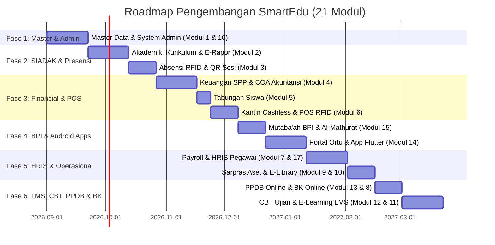

# Rencana Kerja & Roadmap Pengembangan Bertahap 21 Modul SmartEdu

Dokumen ini berisi rencana kerja komprehensif untuk pengadaan dan pengembangan **21 Modul Digital SmartEdu (Sekolah Islam Terpadu)**. Pengembangan disusun secara **bertahap (phased development)** mulai dari **Fase 1: Master Data & Sistem Administrator** sebagai fondasi utama (*single source of truth*) yang akan dikonsumsi oleh seluruh modul dan aplikasi mobile (Android).

---

## 📌 Prinsip Pengembangan & Arsitektur

1. **Master Data First:** Fondasi entitas (Sekolah, Tahun Akademik, Rombel, Siswa, Guru, Ortu, User/Role) dibangun paling awal dengan validasi ketat.
2. **Modular & Scalable API:** Setiap modul backend menyediakan endpoint REST API standar yang akan digunakan oleh Web Admin dan 3 Aplikasi Mobile Android (Parent App, Teacher App, Kiosk/POS App).
3. **Multi-School / Yayasan Context:** Seluruh tabel database dirancang dengan `school_id` middleware untuk mendukung multi-unit sekolah (TK, SD, SMP, SMA) dalam 1 instansi yayasan.

---

## 🗓️ Timeline & Roadmap Pengembangan (Tahap demi Tahap)

---

## 📂 Rincian Tasks & Sub-Modul per Fase

### 🔷 FASE 1: Master Data & System Admin (Fondasi Utam)
> **Goal:** Membangun seluruh referensi entitas dasar sekolah dan manajemen akses role (RBAC) agar sistem siap menerima modul-modul turunan.

#### 1. Modul 1: Master Data & Referensi Akademik
* [ ] **Sub-Modul 1.1: Multi-School & Unit Yayasan (`schools`)**
  * CRUD Profil Sekolah (NPSN, Alamat, Logo, Warna Primary, Kepala Sekolah).
  * Middleware `SchoolContext` untuk filter otomatis data per unit aktif.
* [ ] **Sub-Modul 1.2: Kurikulum & Tahun Akademik (`academic_years`, `curriculums`)**
  * Manajemen Tahun Ajaran (contoh: 2026/2027) & Semester (Ganjil/Genap).
  * Setup Jenis Kurikulum: K13, Kurikulum Merdeka, JSIT, & Kustom.
* [ ] **Sub-Modul 1.3: Tingkat & Rombongan Belajar (`levels`, `classrooms`)**
  * Tingkat Kelas (TK, 1-6 SD, 7-9 SMP, 10-12 SMA).
  * Rombel/Kelas (contoh: 7-Umar bin Khattab) + Assignment Wali Kelas.
* [ ] **Sub-Modul 1.4: Gedung, Ruang & Mata Pelajaran (`rooms`, `subjects`)**
  * Master Ruangan (Kelas, Lab, Lapangan) + Kapasitas.
  * Master Mata Pelajaran (Kode Mapel, Nama, Kelompok K13/Merdeka/Muatan Lokal/JSIT).
* [ ] **Sub-Modul 1.5: Master Data Guru & Staf Pegawai (`employees`)**
  * Biodata lengkap Guru (NIP, NIK, Status Kepegawaian, Gelar, Kontak, User Account).
  * Data Staf Non-Guru (TU, Security, Janitor, Driver).
* [ ] **Sub-Modul 1.6: Master Data Siswa & Orang Tua/Wali (`students`, `guardians`)**
  * Biodata Siswa (NIS, NISN, RFID Tag Code, Status Aktif/Lulus/Mutasi, Rombel aktif).
  * Data Orang Tua/Wali + Relasi Multi-Anak (*1 akun ortu bisa menghubungkan >1 siswa*).
  * Fitur Import/Export Massal Excel Data Siswa & Guru.

#### 2. Modul 16: System Admin & Authorization
* [ ] **Sub-Modul 16.1: Role & Permission (RBAC Spatie/Custom)**
  * Setup 12+ Role Bawaan: `Super Admin Yayasan`, `Admin Sekolah`, `Kepala Sekolah`, `Guru`, `Wali Kelas`, `Guru BK`, `Bendahara/Kasir`, `Admin HRD`, `Kasir Kantin`, `Petugas Perpus`, `Orang Tua`, `Siswa`.
  * Middleware Permission Granular per Aksi (Create, Read, Update, Delete, Export).
* [ ] **Sub-Modul 16.2: System Settings & Audit Log (`site_settings`, `audit_logs`)**
  * Branding Sekolah (Logo, Favicon, Hero Title).
  * Audit Trail untuk mencatat aktivitas penting (Siapa mengubah nilai, Siapa melakukan void pembayaran SPP).

---

### 🔷 FASE 2: Core Akademik & Presensi Realtime

#### 1. Modul 2: Akademik, Penilaian & E-Rapor
* [ ] **Sub-Modul 2.1: RPP & Jadwal Pelajaran Mingguan**
  * Penjadwalan mingguan bebas bentrok (Guru & Ruangan).
  * Jurnal KBM (Materi diajar, Catatan Kelas, Absensi Per Sesi).
* [ ] **Sub-Modul 2.2: Penilaian Multi-Kurikulum**
  * Penilaian K13 (KI-1 Spritual, KI-2 Sosial, KI-3 Pengetahuan, KI-4 Keterampilan).
  * Penilaian Kurikulum Merdeka (Tujuan Pembelajaran / TP, Formatif, Sumatif, Proyek P5).
* [ ] **Sub-Modul 2.3: Rollup Nilai & Cetak Rapor PDF**
  * Agregasi nilai akhir otomatis.
  * Export Rapor UTS & Rapor Akhir Semester format PDF resmi.

#### 2. Modul 3: Absensi Realtime RFID & QR Code
* [ ] **Sub-Modul 3.1: Absensi RFID & QR Code Gate**
  * Integration Endpoint REST API untuk Reader RFID Tap (Siswa & Staf).
  * Sesi QR Code Dinamis Per Kelas (Siswa scan QR guru via Mobile).
* [ ] **Sub-Modul 3.2: Pengajuan Izin & Dashboard Realtime**
  * Form Izin Sakit/Sakit online + Upload Surat Dokter.
  * Realtime Dashboard persentase kehadiran sekolah hari ini.

---

### 🔷 FASE 3: Keuangan Sekolah, SPP, Tabungan & POS Kantin

#### 1. Modul 4: Keuangan Sekolah, SPP & Akuntansi (COA)
* [ ] **Sub-Modul 4.1: Penagihan SPP & Kasir Kwitansi**
  * Generate Tagihan SPP Bulanan Otomatis + Skema Beasiswa/Diskon.
  * Kasir Pembayaran Tunai/Transfer + Cetak Kwitansi PDF.
* [ ] **Sub-Modul 4.2: Chart of Accounts (COA) & Jurnal Otomatis**
  * Setup COA (Kas, Bank, Piutang SPP, Pendapatan, Beban Operasional).
  * Buku Besar, Neraca, & Laporan Arus Kas Otomatis.

#### 2. Modul 5: Tabungan Siswa
* [ ] **Sub-Modul 5.1: Rekening & Teller Tabungan**
  * Master Rekening Tabungan Siswa.
  * Teller Setor/Tarik Tunai + Input Setoran Massal per Kelas.

#### 3. Modul 6: Kantin & POS Multi-Outlet (Cashless)
* [ ] **Sub-Modul 6.1: POS Kantin & NFC/RFID Tap**
  * Aplikasi POS Checkout Kasir Kantin tap Kartu RFID Siswa.
  * Pengaturan Limit Belanja Harian (Diatur orang tua via Portal).
  * Settlement Komisi Tenant / Multi-Outlet Kantin.

---

### 🔷 FASE 4: Character Building (BPI) & Mobile Apps (Android/Flutter)

#### 1. Modul 15: Mutaba'ah BPI & Character Building
* [ ] **Sub-Modul 15.1: Monitoring Amal Harian & Dzikir**
  * Checklist Ibadah (Sholat 5 Waktu, Rawatib, Dhuha, Tahajud, Tilawah, Hafalan, Infaq).
  * Validasi PIN Orang Tua di rumah.
  * Modul Dzikir Al-Mathurat Pagi & Petang + API Jadwal Sholat Kemenag.

#### 2. Modul 14: Portal Siswa & Ortu Mobile Apps
* [ ] **Sub-Modul 14.1: REST API Mobile (Laravel Sanctum)**
  * Endpoint autentikasi, switcher profil anak, data presensi, bill SPP, & BPI.
* [ ] **Sub-Modul 14.2: App Android Flutter (Parent & Student App)**
  * Layout UI Responsive + Dark/Light Theme.
  * Push Notification (FCM) saat presensi siswa tercatat & pengingat SPP.

---

### 🔷 FASE 5: Penunjang Operasional & SDM (HRIS/Payroll)

#### 1. Modul 7 & Modul 17: Payroll, HRIS Pegawai & E-Leave
* [ ] **Sub-Modul 7.1: Payroll & Slip Gaji PDF**
  * Kalkulasi Gaji Pokok, Tunjangan, Potongan BPJS & PPh21, Lembur, Kasbon.
  * Generate E-Slip Gaji PDF di Portal Pegawai.
* [ ] **Sub-Modul 17.1: E-Leave & Evaluasi Kinerja (PKG KPI)**
  * Pengajuan Cuti Berjenjang + Evaluasi Kinerja Guru.

#### 2. Modul 9 & Modul 10: Sarpras Aset & Perpustakaan Digital
* [ ] **Sub-Modul 9.1: Sarana Prasarana (Asset Barcode & Floorplan)**
  * Aset Barcode, Floorplan Gedung, Movement Barang Habis Pakai, Peminjaman.
* [ ] **Sub-Modul 10.1: Perpustakaan Digital (E-Library)**
  * Katalog Buku ISBN, Sirkulasi Pinjam QR, Denda Otomatis, Reader E-Book PDF.

---

### 🔷 FASE 6: E-Learning LMS, CBT, PPDB Online & BK Online

#### 1. Modul 13: PPDB / SPMB Online
* [ ] Wizard 5-Langkah Pendaftaran, Upload Syarat Dokumen, Konfirmasi Bayar.
* [ ] **Fitur Kunci:** Transfer Pendaftar Diterima -> Auto Create Master Data Siswa.

#### 2. Modul 12: CBT (Computer Based Test)
* [ ] Bank Soal Multi-type (PG, Essay, Matching), Proctoring Kamera, Deteksi Tab Switch, & Auto Sync Nilai ke E-Rapor.

#### 3. Modul 11: E-Learning LMS
* [ ] Modul Pembelajaran (Video/PDF), Assignment, Forum Diskusi, & Live Class.

#### 4. Modul 8: Bimbingan Konseling (BK Online)
* [ ] Catatan Pelanggaran & Poin, Booking Sesi Konseling Online, & Foto Log Home Visit.

---

## 🔒 Verification Plan & Kriteria Selesai (Definition of Done)

1. **Ketersediaan Data Master (Fase 1):**
   * Berhasil melakukan Seeding Data Dummy Sekolah, Tahun Akademik, Rombel, 50 Siswa, 10 Guru, dan 10 Orang Tua.
   * Uji coba pembuatan akun & assign Role RBAC berjalan tanpa bocor data antar unit sekolah.
2. **API Readiness:**
   * Seluruh API Endpoint Master Data lulus pengujian Postman/Pest PHP dengan HTTP Response Code status 200/201.
3. **Integrasi Frontend & Mobile:**
   * Halaman Admin CMS Web dapat menambah/mengedit master data secara seamless.
